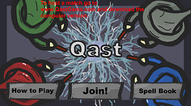
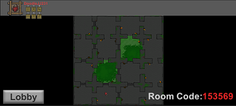
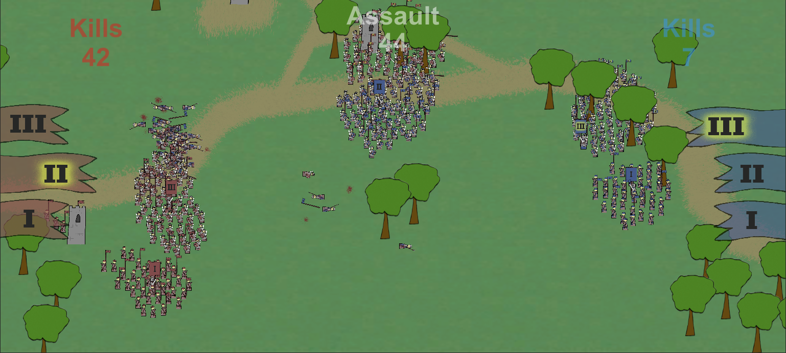
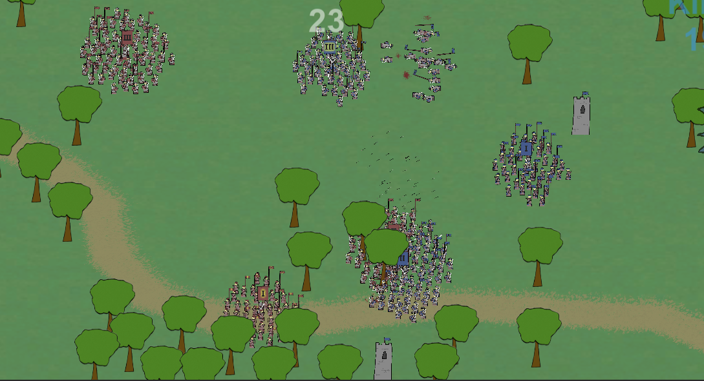
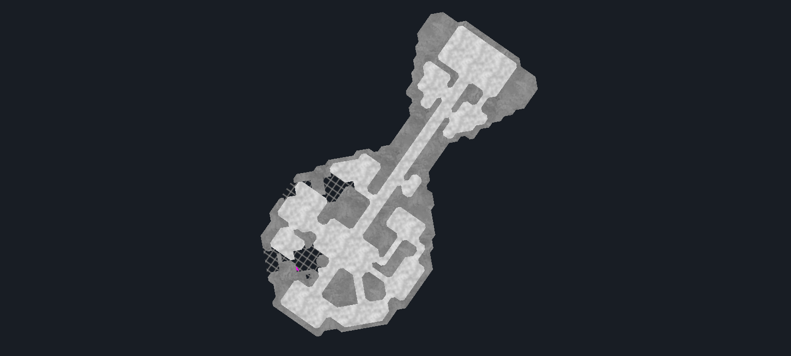
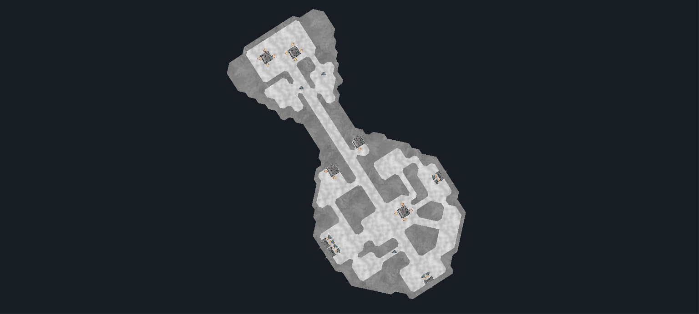
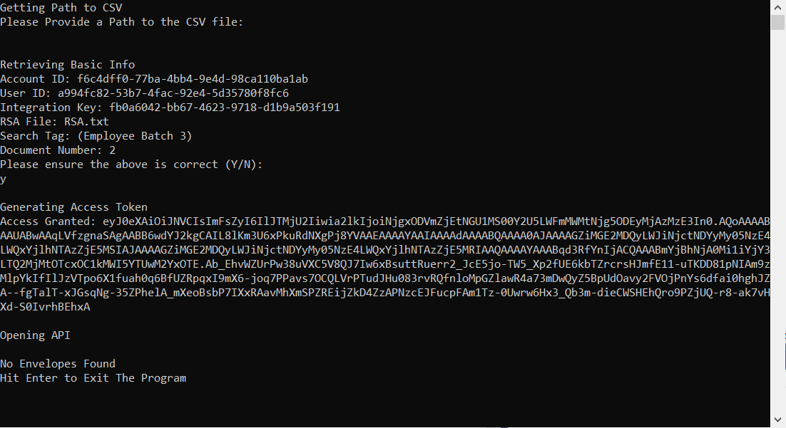
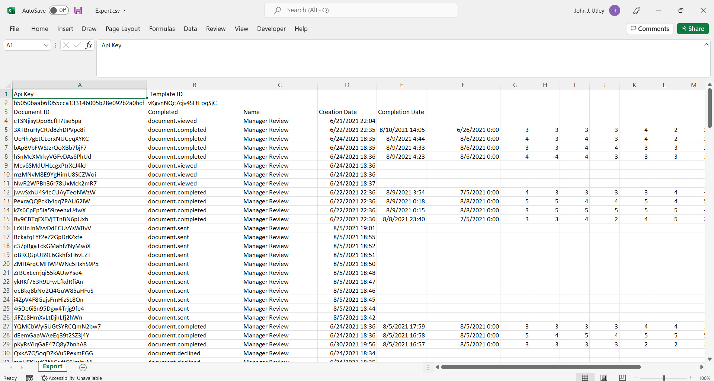

# Portfolio

The majority of my projects are pre-college projects and are not commented but I have recently added ReadMe files to all of them. If you want more information on any particular project navigate to their GitHub repository using the link. I mostly make video games in the Unity Game Engine using C# but some projects are made with C and other languages.

## Qast

A local multiplayer game in which players can use their phones as game controllers to move on a shared desktop that serves as the main screen. The game features a top-down 2D arena where each player gets a frankly adorable wizard character to control. In Qast players draw out different symbols on their phones in order to cast assorted spells at each other. Their accuracy, speed, potency, or general effectiveness is dependent on how well the player draws out the symbols on their phone. It took a lot of network coding and working with various other systems to complete. I think that because I worked on UI, Sound, and Graphics in this project I'll be better equipped to integrate other's work in those areas in  future projects.

[GitHub: Qast](https://github.com/JohnJamesUtley/Qast)

## Nuggets Terminal Video Game
This is a multiplayer video game that me and a small team built in a Software Design and Implementation course. It is built entirely in C and from the ground up. It runs in the terminal. In the game players are placed on a unrevealed premade map. They can only see in their immediate vincinity according to their lines of sight. The goal is for the players to wander around and pick up small gold piles which are randomly placed throughout the map before other players. This program involved a lot of network coding and was built in a SCRUM and Sprint style work enviroment. This project has proper commenting.

[GitHub: Nuggets](https://github.com/cs50spring2021/nuggets-nunchuck-buccaneer)

## Trailblazers
Trailblazers is a top-down RTS game. Although it was never fully prepared for publishing it is fairly polished. It is a two player local multiplayer game. The game involves moving large formations of troops around a battlefield in order to capture key positions. The combat was difficult to program because it is solely based around the shapes formed by lines of combatants. Not Commented but the structure is well organzied and fairly easy to navigate.

[GitHub: Trailblazers](https://github.com/JohnJamesUtley/Trailblazers)

## Spaceships
This is an unfinished project but it has a plethora of interesting systems that were super fun to program. In this project there is code for dynamic destruction and construction through the use of a marching squares algorithm. There is A* pathfinding that adjusts to a changing enviroment as entities are moving and some high speed physics simulation. It is more of a prototype than anything else. Still uncommented but cool I think.

[GitHub: Spaceships](https://github.com/JohnJamesUtley/Spaceships-3)

## Panda Doc Receiver
This is a very rough and quick program I wrote for a Business Internship that I had from June 2021 to September 2021. It uses a website's API to export documents in bulk that have been filled out and signed by employees. The website is similar to DocuSign and is not originally designed for so many documents. It runs in terminal and exports to a CSV file. Not Commented.

[GitHub: Panda Doc Receiver](https://github.com/JohnJamesUtley/Panda-Doc-Receiver)

